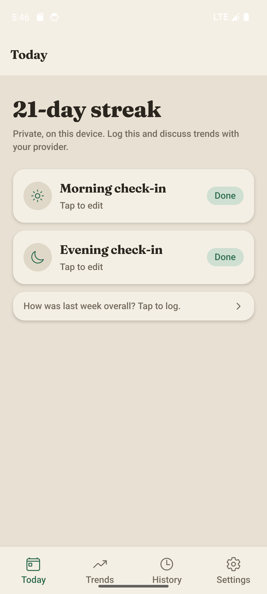
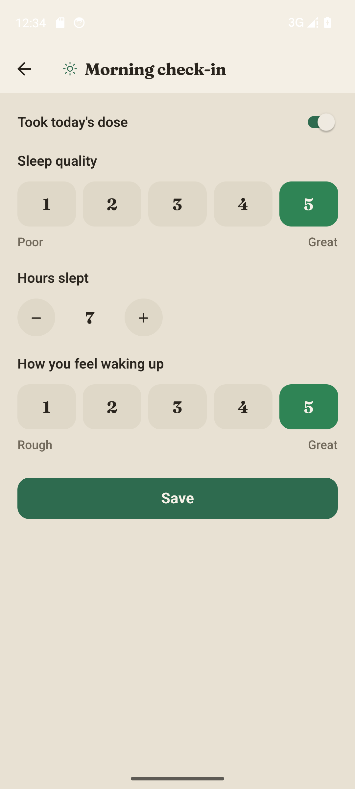
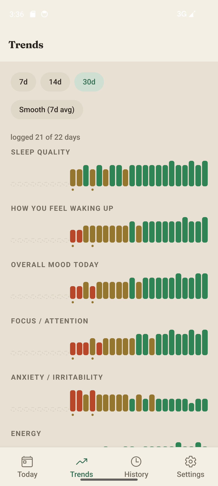
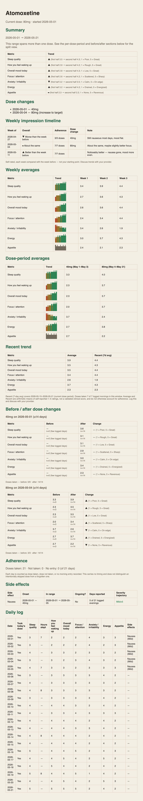

# ADHD Log

A private, on-device daily check-in app for tracking how a new (non-stimulant) ADHD
medication is actually working — because the useful signal shows up over weeks, not in any
single day.

## Why it exists

Non-stimulant ADHD medications build up slowly. One day tells you almost nothing; the
question that matters is _"is this trending the right way over the last few weeks?"_ — and
that's exactly the thing that's hard to feel from the inside.

ADHD Log makes that trend easy to see. You log a quick check-in in the morning and again in
the evening, the app quietly builds the picture over time, and when you have an appointment
you export a clean report to talk through with your provider. Everything stays on your
phone.

## Screenshots

| Today                                       | Morning check-in                                         |
| ------------------------------------------- | -------------------------------------------------------- |
|  |  |

| Trends                                        | Provider report                                     |
| --------------------------------------------- | --------------------------------------------------- |
|  |  |

## What you track

Two short check-ins a day. Nothing takes more than a minute.

**Morning**

- Whether you took today's dose
- Sleep quality
- Hours slept
- How you feel waking up

**Evening**

- Mood, focus, energy, and anxiety / irritability (on by default)
- Optional extras you can switch on: impulsivity, appetite, libido
- Side effects, each with a mild / moderate / severe level
- A free-text note for anything else

You choose which evening ratings show up, so the check-in stays as short as you want it.

## Features

- **Trends** — 7, 14, or 30-day bar charts for each thing you track, with an optional
  rolling-average line to smooth out the day-to-day noise. A coverage caption tells you how
  many days you logged, and dose changes are marked right on the charts.
- **Around dose changes** — before/after cards that show how each metric moved (and how your
  dose adherence looked) in the weeks surrounding a dose change.
- **History** — a simple day-by-day list; tap any day to see the full morning and evening
  detail.
- **Dose log** — record a dose change in Settings; it updates your current dose and keeps a
  running timeline.
- **Reminders** — gentle daily nudges for the morning and evening check-in that open the
  right screen when you tap them.
- **Provider report** — a one-tap PDF that fits itself to the days you've logged. It
  includes weekly averages, dose-period comparisons, side-effect trajectories, and adherence
  — written plainly, and careful never to dress self-reported ratings up as a clinical score.
  Notes are optional and off unless you include them.
- **Backup & restore** — export your data as JSON and bring it back later.
- **Lock** — an optional Face ID / passcode lock on open.

## Privacy

Your data lives only on your device (in local storage). There are no accounts, no servers,
and no analytics — nothing is uploaded, ever. The only way data leaves your phone is when
_you_ share an export: a PDF for a provider, or a JSON backup for yourself.

## A quick note

This is a personal tracking tool, not medical advice. It's a log to help you notice patterns
and discuss them with your provider — not a diagnosis or a clinical assessment.

## Tech stack

Expo (SDK 57) + React Native 0.86, expo-router, and TypeScript in strict mode. Local storage
via AsyncStorage. Logic is unit-tested with Vitest.

## Getting started

You'll need a recent Node LTS and npm. (The repo's `.npmrc` sets `legacy-peer-deps=true`, so
a plain install works as-is.)

```bash
npm install
npm start        # Expo dev server — press i / a / w for iOS sim, Android, or web
```

Other ways to run it:

```bash
npm run ios      # build & run a native iOS dev build
npm run android  # build & run a native Android dev build
npm run web      # run in the browser
npm run apk      # build an Android APK (npm run apk:clean for a clean build)
```

## Testing & quality

```bash
npm test         # Vitest with coverage
npm run reports  # just the scenario / report tests
npm run check    # full gate: typecheck → lint → format check → test → type-coverage
```

`npm run check` is the same gate CI runs. A husky pre-commit hook runs the relevant slice of
it (lint, format check, type-check, type-coverage, and related tests) on staged files, so
most problems are caught before they land.

The type system is deliberately strict — illegal states are modeled so they can't be
represented, and type coverage is held at 100%. See [`CLAUDE.md`](CLAUDE.md) for the full
contract and the reasoning behind it.

## Project layout

- `app/` — screens and navigation (Today / Trends / History / Settings tabs, plus check-in,
  day detail, and onboarding)
- `components/` — small presentational pieces (scale selector, chips, toggle, stepper, lock
  screen)
- `hooks/` — shared React / router hooks
- `lib/` — the RN-free core: types, the check-in schema, storage, notifications, export, and
  the design tokens/theme. This is where the testable logic lives.
